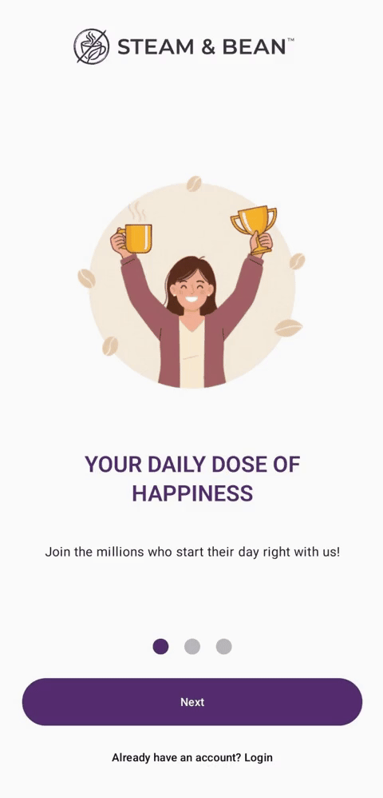

# Steam & Bean
[](https://deepwiki.com/Brave6/Coffee_Bean)

Steam & Bean App is a sample Android application for a modern coffee shop, built to showcase a full-featured user experience using the latest Android development technologies. From user authentication and onboarding to browsing a dynamic menu and managing a shopping cart, this app serves as a practical example of a client-facing e-commerce application.

The entire application is built with Jetpack Compose and integrates deeply with Firebase for backend services, demonstrating a modern, reactive approach to Android development.

---
## Screenshots
<p align="center">
  
</p>


## Features

- **User Authentication**: Secure sign-up and login with email/password and Google Sign-In, powered by Firebase Authentication.
- **Onboarding Experience**: A sleek, multi-page onboarding flow for first-time users.
- **Dynamic Home Screen**: Features a promotional carousel and a "Popular Now" section populated from Firestore.
- **Interactive Menu**: Browse menu items categorized by Coffee, Beans, Cakes, and Pastry.
- **Product Details**: A detailed view for each product with a parallax image effect, size/temperature customization, nutritional information, and quantity selection.
- **Shopping Cart**: Fully functional cart where users can add, update quantities, and remove items. All cart data is persisted in Firestore.
- **Favorites**: Users can mark products as favorites, with selections saved to their account.
- **User Profile**: An account screen displaying user information, loyalty points, and a logout option.
- **Rewards System**: A basic rewards screen showing user points and progress toward the next reward.
- **Checkout Flow** Integrated Google Maps, payment methods, and order summary.
- **Firebase Integration**: Leverages Firebase for Authentication, Firestore database, Cloud Storage (for images), and Analytics for promotion tracking.

## Tech Stack & Architecture

This project is built with a modern Android technology stack and follows clean architecture principles.

- **UI**: 100% Jetpack Compose using the Material 3 design system.
- **Architecture**: Model-View-ViewModel (MVVM).
- **Dependency Injection**: Hilt for managing dependencies throughout the app.
- **Asynchronous Programming**: Kotlin Coroutines and Flow for handling background tasks and reactive data streams.
- **Navigation**: Jetpack Navigation for Compose, with custom animations.
- **Backend**:
  - **Firebase Authentication** for user management.
  - **Firebase Firestore** as the real-time database for products, promos, carts, and favorites.
  - **Firebase Cloud Storage** for hosting product and promo images.
  - **Firebase Analytics** for promotion tracking.
- **Image Loading**: Coil for efficient and fast image loading from URLs.
- **Local Storage**: Jetpack DataStore for persisting simple key-value data (like the onboarding completion flag).

## Getting Started

To get the project up and running, follow these steps:

1.  **Clone the repository:**
    ```bash
    git clone git@github.com:Brave6/steam-bean-app.git
    ```

2.  **Open in Android Studio:**
    Open the cloned directory in the latest version of Android Studio.

3.  **Firebase Configuration:**
    The project includes a `google-services.json` file connected to a sample Firebase project. The data for products and promotions is already populated. You can run the app as-is to see it in action.

    If you wish to connect your own Firebase project:
    - Create a new project on the [Firebase Console](https://console.firebase.google.com/).
    - Add an Android app with the package name `com.coffeebean`.
    - Download the generated `google-services.json` file and replace the existing one in the `app/` directory.
    - Set up Firebase Authentication (enable Email/Password and Google providers).
    - Set up Firestore and populate the `products` and `promos` collections.

4.  **Build and Run:**
    Sync the project with Gradle files and run it on an Android emulator or a physical device (API 24+).

## Project Structure

The project is organized into packages that follow clean architecture principles, separating concerns for better maintainability and scalability.

-   `com.coffeebean.di`: Hilt dependency injection modules.
-   `com.coffeebean.data`: Contains repository implementations and data sources.
    -   `local`: Local data handling (DataStore).
    -   `remote`: Remote data handling (Firebase client and repository implementations).
-   `com.coffeebean.domain`: Core business logic, including data models and repository interfaces.
-   `com.coffeebean.ui`: All Jetpack Compose UI elements.
    -   `feature`: Screens and components organized by feature (e.g., `home`, `login`, `menu`).
    -   `main`: The main app container with the bottom navigation bar.
    -   `navigation`: Navigation graph and screen definitions.
    -   `theme`: App theme, colors, and typography.
